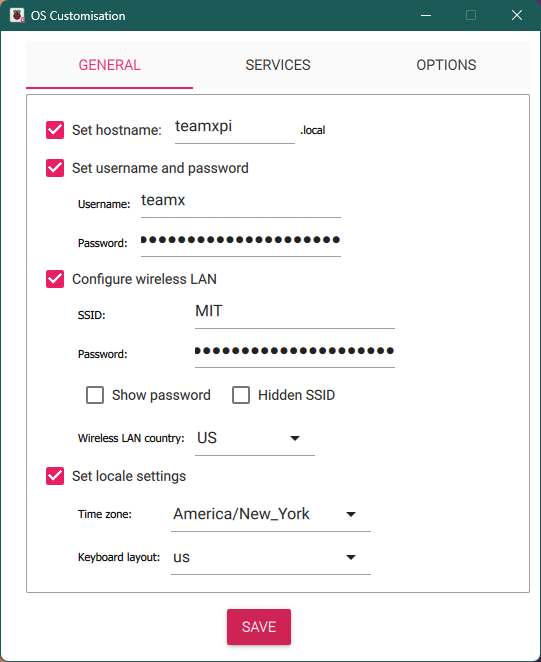
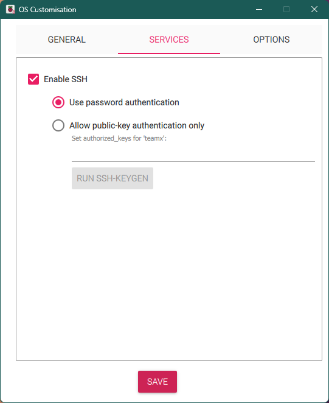

# MASLAB Raspberry Pi Setup

This repository contains the scripts used for setting up the Raspberry Pi development environment for MASLAB.

Currently, the script handles the following:
- Installing `build-essential`
- Installing `gpio-zero`
- Installing the base ROS Jazzy with `colcon` extensions
- Setting up network connections
    - Connect to EECS-Labs
    - DHCP server on Ethernet to remote in over ethernet at fixed `192.168.1.1` IP
- Setting up Poll Me Maybe
- Enabling `PIP_BREAK_SYSTEM_PACKAGES` to allow installation of python libraries
- Enabling UART interface
- Setting up hardware pins to interact with [Raven](https://github.com/MASLAB/raven) board
- Loading firmware onto [Raven](https://github.com/MASLAB/raven) board
- Configurating Git + generating SSH key
- Cloning `kitbot` and team's MASLAB repo 

## Setup Steps

Prerequisites:
- Git repo set up for each team (normally on MIT Github)
- A Raspberry Pi per team with SSD and RAM installed
- SD card set up by Raspberry Pi Imager with
    - Ubuntu 24.04 **server**
    - These customisations (change `x` to team number)  
      
      

For each Raspberry Pi:  
1. Clone this repo with:  
    `git clone https://github.com/MASLAB/raspi-setup`
2. Run setup script, passing in team number as first argument and MASLAB year as second argument:  
   `./setup.sh <team-number> <maslab-year>`
3. Copy SSH public key (output of script) and add it as a deploy key to the team repo
   
And you're done! Keep this repo to update [Raven](https://github.com/MASLAB/raven) firmware:  
`./update-firmware.sh`